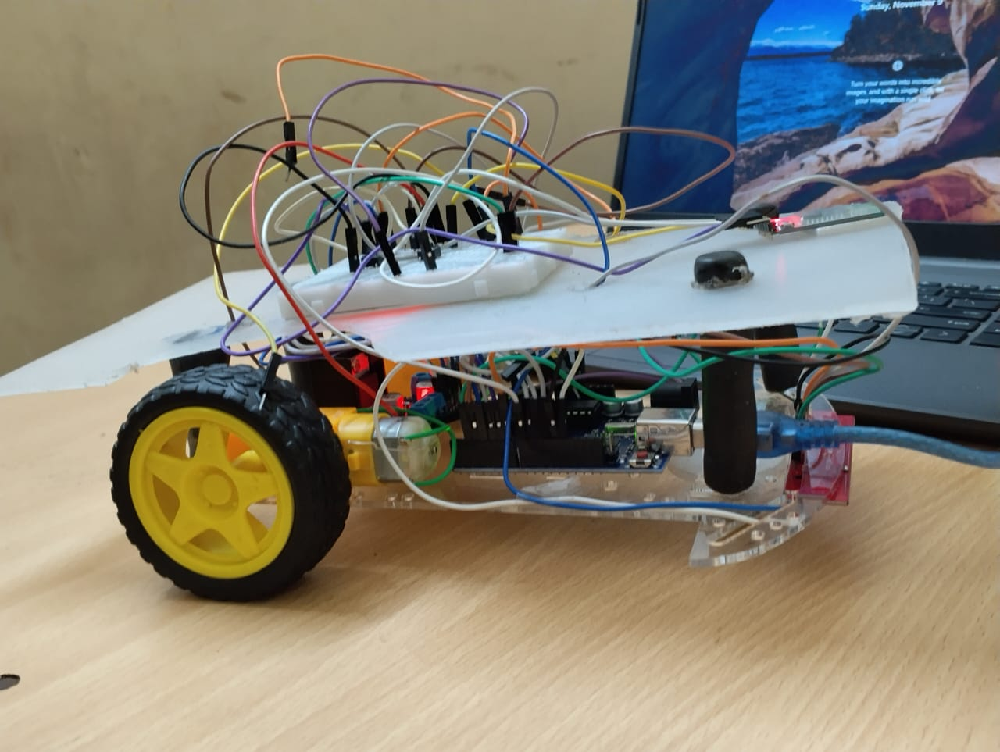
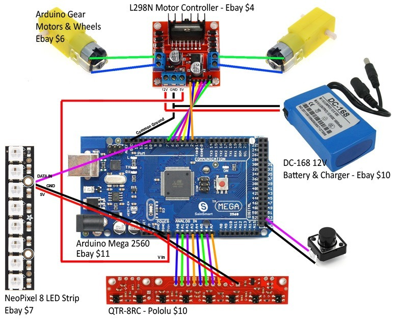
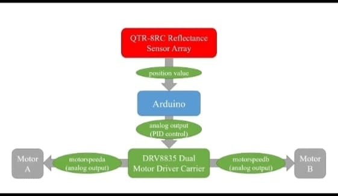

📌 Line Follower Robot using PID controller and Ardunio uno)

📖 Introduction

The PID controller is a powerful approach for improving the accuracy and efficiency of linefollowing robots. By adjusting the PID apparatus -proportional (kp), integral(Ki), and derivative
(Kd)- engineers can optimize the robot’s response to path deviations and enhance its stability. This
control system is widely used in industry and is essential for the development of autonomous and  navigation robot.

🎯 Objective
To enable a robot to follow a predefined path (usually a black line on a white surface or vice
versa) smoothly, accurately, and efficiently by continuously correcting its movement using a
feedback control system.

✔️ TABLE OF CONTENTS

PID-Line-Follower-Robot-Arduino-Project

📂 Project Structure

📸 Photos

✨ Features

🛠️ Tech Stack

⚙️ Working Principle

🚀 Future Improvements

🙏 Acknowledgements

👨‍💻 Author

📂 Project Structure
LineFollower-Robot/
│
├── code/                    # Arduino Code (PID + Sensors)
├── images/                  # Photos of robot, circuit, testing track
├── README.md                # Project documentation
└── circuit-diagram.png      # Full connection diagram

📸 Photos

✨ Features

🚦 PID Controller (Kp, Ki, Kd tuning) for smooth & accurate movement

🖤 Follows black line on white surface precisely

⚙️ Automatic speed + direction correction

🔃 Handles curves and sudden turns without losing line

🧠 Error feedback loop for high-speed stability

🔌 Uses efficient motor driver control with PWM

🛠️ Tech Stack
Component	Purpose
Arduino UNO	Microcontroller (main brain)
QTR-8RC Sensor	Line detection
L298N Driver	Motor direction & speed control
DC Motors + Wheels	Smooth motion
PID Algorithm	Intelligent control
Li-Po Battery	Power supply
HC-05 bluetooth module-For controlling it through phone
⚙️ Working Principle

✔ Reads values from reflectance sensors
✔ Calculates error from track center
✔ Applies PID formula:

Output = (Kp * P) + (Ki * I) + (Kd * D)

✔ Adjusts left & right motor speeds
✔ Robot keeps itself aligned on line continuously 🚗💨

Flow:

Start → Sensor Read → Error Detection → PID Calculation → Motor Control → Loop

🚀 Future Improvements

🌐 Add Bluetooth mobile app for PID tuning
📏 Support for intersections and sharp branching
🧭 Add encoders for path optimization
🤖 Add obstacle avoidance using ultrasonic sensor

🙏 Acknowledgements

✔ Inspired by industrial automation & robotics
🙌 Thanks to Pololu QTR sensor open source libraries
🧑‍🏫 Guided by control system & embedded design fundamentals

 ## 👨‍💻Author
Aman kumar
[GitHub](https://github.com/Aman-coder2004)